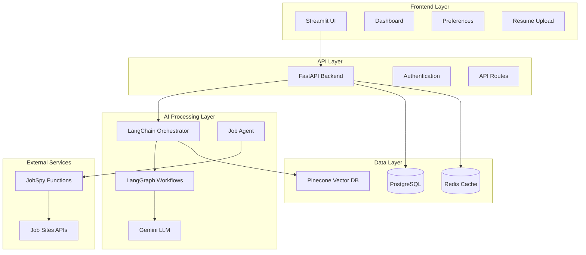

# Design Document

## Overview

The AI Job Agent is a sophisticated job application automation system built with a FastAPI backend and Streamlit frontend. The system leverages LangChain and LangGraph for AI orchestration, Gemini for language processing, Pinecone for vector storage, and JobSpy for job data collection. The architecture follows a microservices approach with clear separation between the user interface, business logic, and data persistence layers.

## Architecture

### High-Level Architecture



### Technology Stack

- **Frontend**: Streamlit for interactive web interface
- **Backend**: FastAPI for REST API and async processing
- **AI Framework**: LangChain for AI orchestration, LangGraph for workflow management
- **LLM**: Google Gemini for text processing and generation
- **Vector Database**: Pinecone for resume and job embeddings
- **Primary Database**: PostgreSQL for structured data with Prisma ORM
- **Cache**: Redis for session management and temporary data
- **Job Data**: JobSpy functions integrated directly for multi-platform job scraping

## Components and Interfaces

### 1. Streamlit Frontend Components

#### Resume Upload Component

- File upload widget supporting PDF, DOC, DOCX
- Progress indicator for processing
- Preview of extracted resume data
- Validation and error handling

#### User Preferences Component

- Form-based preference configuration
- Job search criteria (title, location, salary, etc.)
- Application automation settings
- Company and industry preferences

#### Dashboard Component

- Application statistics and metrics
- Recent applications table with filtering
- Job match scores and status tracking
- Activity timeline and logs

#### Job Review Component

- Job recommendations with match scores
- Manual approval interface for applications
- Resume and cover letter preview
- Application status updates

### 2. FastAPI Backend Services

#### Authentication Service

```python
class AuthService:
    async def authenticate_user(self, credentials: UserCredentials) -> User
    async def create_session(self, user: User) -> SessionToken
    async def validate_session(self, token: str) -> User
```

#### Resume Service

```python
class ResumeService:
    async def upload_resume(self, file: UploadFile, user_id: str) -> ResumeData
    async def parse_resume(self, file_content: bytes) -> ParsedResume
    async def customize_resume(self, resume: ResumeData, job: JobPost) -> CustomizedResume
    async def store_resume_embedding(self, resume: ParsedResume) -> str
```

#### Job Service

```python
class JobService:
    async def search_jobs(self, criteria: SearchCriteria) -> List[JobPost]
    async def calculate_match_score(self, resume: ResumeData, job: JobPost) -> float
    async def filter_jobs(self, jobs: List[JobPost], preferences: UserPreferences) -> List[JobPost]
    async def store_job_embedding(self, job: JobPost) -> str
```

#### Application Service

```python
class ApplicationService:
    async def generate_cover_letter(self, resume: ResumeData, job: JobPost) -> CoverLetter
    async def submit_application(self, application: JobApplication) -> ApplicationResult
    async def track_application_status(self, application_id: str) -> ApplicationStatus
    async def get_application_history(self, user_id: str) -> List[JobApplication]
```

### 3. AI Processing Components

#### LangChain Orchestrator

- Coordinates AI workflows and tool usage
- Manages context and memory for conversations
- Handles prompt engineering and response processing

#### LangGraph Workflow Engine

- Defines multi-step job application workflows
- Manages state transitions and error handling
- Orchestrates resume customization and cover letter generation

#### Gemini Integration

- Text analysis and generation
- Resume parsing and skill extraction
- Job description analysis and matching
- Cover letter personalization

### 4. Data Models

#### User Model

```python
class User(BaseModel):
    id: str
    email: str
    created_at: datetime
    preferences: UserPreferences
    resume_data: Optional[ResumeData]
```

#### Resume Data Model

```python
class ResumeData(BaseModel):
    id: str
    user_id: str
    original_filename: str
    parsed_content: ParsedResume
    embedding_id: str
    created_at: datetime
    updated_at: datetime
```

#### Job Application Model

```python
class JobApplication(BaseModel):
    id: str
    user_id: str
    job_post: JobPost
    customized_resume: CustomizedResume
    cover_letter: CoverLetter
    status: ApplicationStatus
    match_score: float
    applied_at: datetime
    last_updated: datetime
```

#### User Preferences Model

```python
class UserPreferences(BaseModel):
    job_titles: List[str]
    locations: List[str]
    salary_range: SalaryRange
    employment_types: List[JobType]
    preferred_companies: List[str]
    excluded_companies: List[str]
    automation_settings: AutomationSettings
```

## Data Models

### Prisma Schema

```prisma
generator client {
  provider = "prisma-client-py"
}

datasource db {
  provider = "postgresql"
  url      = env("DATABASE_URL")
}

model User {
  id           String   @id @default(cuid())
  email        String   @unique
  passwordHash String   @map("password_hash")
  createdAt    DateTime @default(now()) @map("created_at")
  updatedAt    DateTime @updatedAt @map("updated_at")
  
  resumes      Resume[]
  applications Application[]
  preferences  UserPreferences?
  
  @@map("users")
}

model Resume {
  id               String   @id @default(cuid())
  userId           String   @map("user_id")
  originalFilename String   @map("original_filename")
  fileContent      Bytes    @map("file_content")
  parsedContent    Json     @map("parsed_content")
  embeddingId      String   @map("embedding_id")
  createdAt        DateTime @default(now()) @map("created_at")
  
  user         User          @relation(fields: [userId], references: [id], onDelete: Cascade)
  applications Application[]
  
  @@map("resumes")
}

model JobPost {
  id          String   @id @default(cuid())
  title       String
  companyName String   @map("company_name")
  jobUrl      String   @map("job_url")
  location    Json
  description String
  requirements Json
  salaryInfo  Json     @map("salary_info")
  embeddingId String   @map("embedding_id")
  scrapedAt   DateTime @default(now()) @map("scraped_at")
  
  applications Application[]
  
  @@map("job_posts")
}

model Application {
  id                      String            @id @default(cuid())
  userId                  String            @map("user_id")
  jobPostId               String            @map("job_post_id")
  resumeId                String            @map("resume_id")
  status                  ApplicationStatus
  matchScore              Float             @map("match_score")
  customizedResumeContent String            @map("customized_resume_content")
  coverLetterContent      String            @map("cover_letter_content")
  applicationUrl          String?           @map("application_url")
  appliedAt               DateTime          @default(now()) @map("applied_at")
  lastStatusUpdate        DateTime          @updatedAt @map("last_status_update")
  
  user    User    @relation(fields: [userId], references: [id], onDelete: Cascade)
  jobPost JobPost @relation(fields: [jobPostId], references: [id])
  resume  Resume  @relation(fields: [resumeId], references: [id])
  
  @@map("applications")
}

model UserPreferences {
  id              String   @id @default(cuid())
  userId          String   @unique @map("user_id")
  preferencesData Json     @map("preferences_data")
  createdAt       DateTime @default(now()) @map("created_at")
  updatedAt       DateTime @updatedAt @map("updated_at")
  
  user User @relation(fields: [userId], references: [id], onDelete: Cascade)
  
  @@map("user_preferences")
}

enum ApplicationStatus {
  PENDING
  SUBMITTED
  VIEWED
  REJECTED
  INTERVIEW_SCHEDULED
  OFFER_RECEIVED
  ACCEPTED
  DECLINED
}
```

### Database Integration with Prisma

#### Prisma Client Usage
```python
from prisma import Prisma
from prisma.models import User, Resume, JobPost, Application

class DatabaseService:
    def __init__(self):
        self.db = Prisma()
    
    async def connect(self):
        await self.db.connect()
    
    async def disconnect(self):
        await self.db.disconnect()
    
    async def create_user(self, email: str, password_hash: str) -> User:
        return await self.db.user.create({
            'email': email,
            'passwordHash': password_hash
        })
    
    async def get_user_with_resumes(self, user_id: str) -> User:
        return await self.db.user.find_unique(
            where={'id': user_id},
            include={'resumes': True, 'preferences': True}
        )
```

### Vector Storage Schema (Pinecone)

#### Resume Embeddings

- Namespace: "resumes"
- Metadata: user_id, resume_id, skills, experience_level
- Vector: Resume content embedding

#### Job Embeddings

- Namespace: "jobs"
- Metadata: job_id, company, location, requirements
- Vector: Job description embedding

## Error Handling

### Error Categories

#### Validation Errors

- Invalid file formats for resume upload
- Missing required fields in preferences
- Malformed API requests

#### Processing Errors

- Resume parsing failures
- Job scraping timeouts
- AI service unavailability

#### Application Errors

- Job site authentication failures
- Application submission errors
- Rate limiting from job sites

### Error Handling Strategy

#### Retry Logic

- Exponential backoff for transient failures
- Circuit breaker pattern for external services
- Dead letter queues for failed job applications

#### User Communication

- Clear error messages in Streamlit interface
- Progress indicators for long-running operations
- Fallback options when services are unavailable

#### Logging and Monitoring

- Structured logging with correlation IDs
- Error tracking and alerting
- Performance metrics and dashboards

## Testing Strategy

### Unit Testing

- Individual service method testing
- Mock external dependencies (JobSpy, Gemini, Pinecone)
- Data model validation testing
- Utility function testing

### Integration Testing

- API endpoint testing with test database
- AI workflow testing with mock LLM responses
- Database integration testing
- External service integration testing

### End-to-End Testing

- Complete user workflow testing
- Streamlit UI automation testing
- Job application process testing
- Error scenario testing

### Performance Testing

- Load testing for concurrent users
- Database query performance testing
- AI processing latency testing
- Memory usage and optimization testing

### Test Data Management

- Synthetic resume generation for testing
- Mock job posting data
- Test user accounts and preferences
- Isolated test environments

### Continuous Testing

- Automated test execution in CI/CD pipeline
- Test coverage reporting
- Performance regression testing
- Security vulnerability scanning
